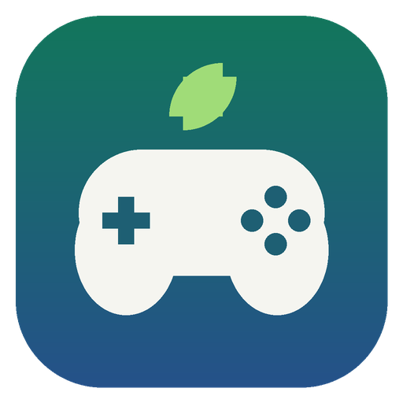

#  Eden Launcher

**Pick which controller is Player 1, 2, 3… for the [Eden](https://eden-emu.dev) Switch emulator, using only your controllers, right before the game starts.**

Made for game streaming (**Sunshine / Vibeshine / Apollo** host + **Moonlight** client), and just as useful on a couch PC.

**[⬇ Download EdenLauncher.exe](https://github.com/Fabiobatta/EdenController/releases/latest)** (Windows)

---

## Why

Eden stores each player's controller as a GUID plus a *connection order*. When you stream, every Moonlight controller shows up on the host as an identical virtual Xbox pad, so the only thing that tells Player 1 from Player 2 is which pad connected first. One controller waking up late and your players are swapped or dead, and fixing it means mouse and keyboard in Eden's settings.

## How it works

1. Start `EdenLauncher.exe` instead of Eden. A fullscreen, controller-only screen opens.
2. Everyone presses **A** on their controller: first press = Player 1, second = Player 2, and so on (up to 8). Your pad rumbles once for P1, twice for P2…
3. Press **Start**: pick a game from the grid (or it launches the game passed by your streaming app).
4. The launcher rewrites only the controller part of Eden's config, turns on docked (TV) mode for 2+ players, and starts Eden.

Nothing else in your Eden setup is touched. The interface is in English or Italian (follows Windows).

## Features

- **Xbox button layout**: the A button (bottom) is Switch A, so you accelerate in Mario Kart with the button labelled A. A Nintendo (positional) layout and your own Eden profiles are available per player.
- **Game grid**: Playnite-style covers over a slowly drifting, blurred background. Updates and DLC are hidden (title IDs are read from the files).
- **Player count on every cover**: green if the game supports everyone who joined, red if not. **Y** shows only games that fit your group.
- **Roulette** (**X**): a spinning strip that picks a random game, only among games that support all joined players.
- **Play time, recent and favourites**: sort by recent / A–Z / most played; **Y** on the player screen resumes your last game.
- **Save backups**: your Eden saves are zipped before each launch (last 10 kept per game, skipped if unchanged).
- **Achievements**: 14 small rewards ("Party of four", "Marathon", "Night owl"…), shown with **RB**.
- **Close a frozen game**: hold **Back + LB + RB** on any controller.
- Rumble, interface sounds, and a selection colour taken from each game's cover.

## Controls

| Where | Button | Action |
| :--- | :--- | :--- |
| Players | **A** / **B** | Join / leave |
| Players | **X** | Change your button layout |
| Players | **Y** | Resume the last game |
| Players | **RB** | Achievements |
| Players | **Start** | Choose a game |
| Game grid | **A** / **B** | Play / back |
| Game grid | **X** | Roulette |
| Game grid | **Y** | Only games for all players |
| Game grid | **Start** / **Back** | Sort / favourite |
| In game | **Back + LB + RB** | Close menu (back to launcher, desktop, or resume) |

## Setup

1. Put `EdenLauncher.exe` **in the same folder as `eden.exe`**. Or anywhere else, with an `EdenPath.config` file next to it containing Eden's folder path.
2. In Eden, set up **Player 1** once with an Xbox controller (Configure → Controls → Auto-map) and save. The launcher copies that mapping to every player.
3. In Sunshine / Vibeshine, add an application:
   - **Command**: `"C:\Emulators\Eden\EdenLauncher.exe"`. Game grid included.
   - Or one app per game: `"C:\...\EdenLauncher.exe" -f -g "D:\Switch\Game.nsp"`. Arguments go straight to Eden.
   - **Working directory**: Eden's folder.
4. Connect all controllers in Moonlight, start the app, press A in the order you want.

**Tips**

- **More than 4 players**: Windows XInput stops at 4 pads. Set the host's gamepad emulation to **DS4** for up to 8.
- **Per-game input profiles** set in Eden (custom game config) override the launcher. Keep game controls on the global config.
- **Logs**: `%APPDATA%\eden\log\EdenLauncher_*.log`, or `<Eden>\user\log` for portable Eden.

## Settings

`EdenLauncher.ini` is created next to the exe on first run. The main options:

| Option | Default | What it does |
| :--- | :--- | :--- |
| `language` | `auto` | `auto`, `en` or `it` |
| `layout` | `Xbox` | `Xbox`, `Nintendo` or the name of an Eden input profile |
| `docked` | `auto` | Docked mode: `auto` (2+ players), `always` or `never` |
| `controller_applet` | `off` | Skip the mouse-only "connect controllers" window some games open |
| `game_dirs` | *(empty)* | Game folders separated by `;`. Empty means Eden's own folders |
| `kill_combo` | `back+lb+rb` | Buttons that open the close menu in game |
| `backup_saves` / `backup_dir` / `backup_keep` | `true` / `saves_backup` / `10` | Save backups |
| `sounds` / `rumble` | `true` | Interface sounds and rumble |
| `steamgriddb_api_key` | *(empty)* | Free key to auto-download missing covers from SteamGridDB |

Custom covers go in `covers\<Title ID or game name>.png` (portrait 2:3). Wrong player count? Add `[Players]` with `Game name = 4`.

**Restoring a save backup**: close Eden, open the zip from `saves_backup` and extract its `0000000000000000` folder into `%APPDATA%\eden\nand\user\save\` (portable Eden: `<Eden>\user\nand\user\save\`).

## Building from source

Python 3.10+. Run `build.bat Eden` (Windows) or `./build.sh Eden` (Linux). The exe ends up in `dist\`. Tests: `python -m unittest discover -s tests`.

## Credits and license

Based on [RyujinxLauncher](https://github.com/Artomos-dev/RyujinxLauncher) by **Artomos**. Player counts and eShop art come from [blawar/titledb](https://github.com/blawar/titledb). Licensed **CC BY-NC 4.0** (non-commercial, with attribution), see [LICENSE.md](LICENSE.md).

Not affiliated with Eden, Ryujinx or Nintendo. Use only with games you legally own.
